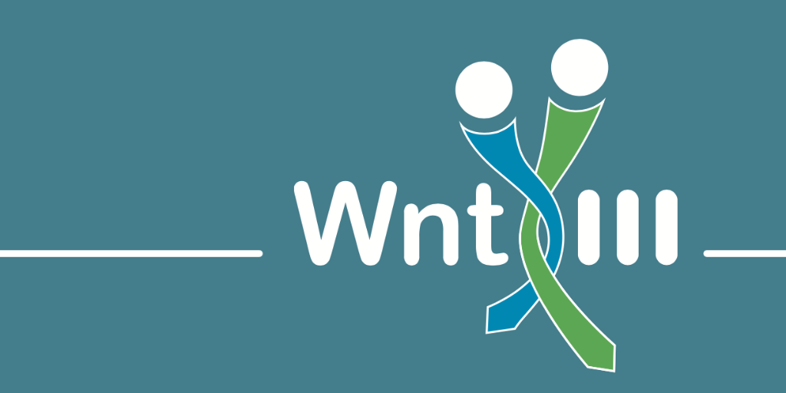

## Welcome to the SFB1324 website

Our grant application for a Collaborative Research Center on Wnt signaling has been funded by the German Research Foundation (DFG). 

* [DFG press release](http://www.dfg.de/service/presse/pressemitteilungen/2017/pressemitteilung_nr_16/index.html)
* [Heidelberg University press release](http://www.uni-heidelberg.de/presse/news2017/pm20170526_new-collaborative-research-center-on-a-fundamental-signaling-pathway-in-development-and-disease.html)

The Collaborative Research Center 1324 (SFB1324) entitled *Mechanisms and Functions of Wnt signaling* will begin on July 1st, 2017.

More information coming soon ...
  

